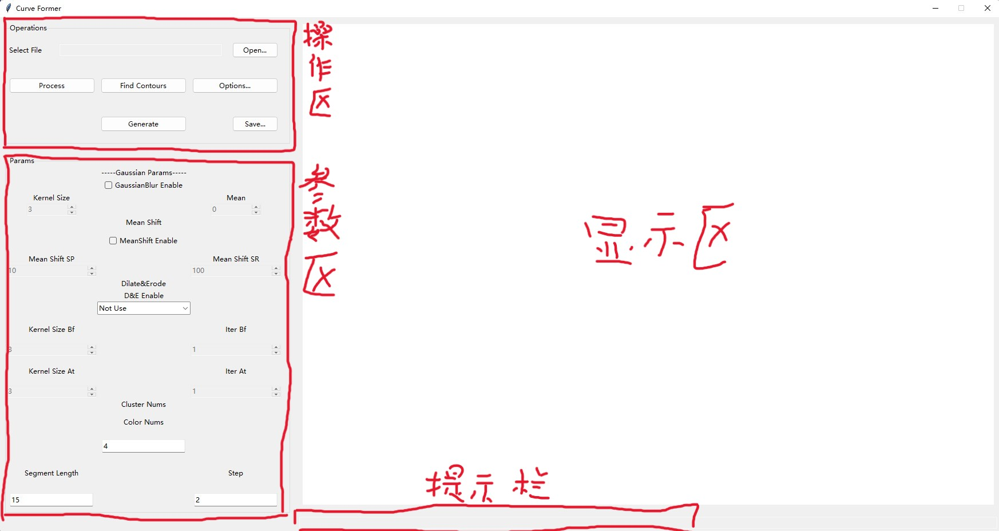
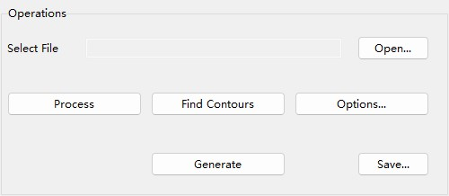

# 位图轨迹生成器

### 1. 软件介绍
本软件是由19374183梅济东编写的一款从彩色位图生成矢量轮廓曲线的软件. 主要用于生成便于随画布大小尺度变化不失真的加工参数曲线, 采用的主要算法是最小二乘法拟合三次正则曲线. 软件界面如下图所示,

用户界面主要分为三个部分: 左上角的是操作区, 用于进行下一步的操作; 左边中下方的是参数设置区, 用于设置各种处理时的参数; 右边是图像显示区, 用于显示各个步骤处理后的图像; 下方是提示栏, 用于提示最近一步的操作. 具体操作步骤如下:

1. 首先, 点击操作区中的"Open..."按钮, 选择一张图片并打开它.

2. 打开的图片会自动根据参数区中选择的参数进行预处理, 这时提示栏提示当前操作为"Processing Image!", 所有操作键处于不可使用状态, 处理完成后可以通过点击"Process"按钮进行查看. "Process"按钮被点击后, 按钮上的文字会被替换为"Origin", 此时再点击"Origin"可以回到原始图像的页面.

3. 根据处理后的图片进一步调整参数, 现在可以调整的有高斯滤波, 颜色均值,  腐蚀膨胀和KMeans聚类的参数.

4. 调整完参数后会自动预处理图像并刷新. 可根据刷新后的图像做进一步的参数调整, 直到符合要求为止.
5. 参数调整完成后, 点击"Find Contours"按钮, 软件开始寻找给定图像的边界并将轮廓显示在显示区, 输出样例如下图所示. 此时依然可以点击"Origin\Process"按钮查看之前预处理后的图像或原图像.

6. 生成轮廓图像之后, 如果对轮廓图像满意, 可以点击"Generate"按钮, 生成一张通过三次曲线拟合的矢量图, 如下图所示.

7. 如果对生成的矢量图满意的话, 可以点击"Save..."按钮, 将生成的曲线参数列表保存到同目录下的 **files/[图像名称].txt** 文档中. 如果在5-7的任何一步中对处理结果不满的话, 可以通过随时更改参数, 然后重复5-7步.
### 2. 版本需求
本程序的库依赖如下.
```
matplotlib=3.5.3=py38haa95532_0
numpy=1.23.3=py38h3b20f71_0
opencv=4.6.0=py38h104de81_2
pillow=9.2.0=py38hdc2b20a_1
scikit-learn=1.1.3=py38hd77b12b_0
tk=8.6.12=h2bbff1b_0
```
另外, 需要改将gui.pyw文件中的第一行改为你的pythonw路径.
### 3. 算法介绍
##### 预处理
预处理过程中提供的可选项有高斯滤波, 均值漂移以及腐蚀膨胀. 必要的步骤有KMeans颜色聚类实现色彩降阶, 通常将图像的颜色降为4阶或6阶, 但是KMeans降阶后的图片有时在同一色块内也会有较大的局部色差使得在轮廓寻找时会有多余的线条, 这对于简化作画是不利的. 因此需要均值漂移等过程降低由于局部色差产生的多余线条.如下图所示, 上图是没有经过均值漂移处理的轮廓图像, 下图是经过核心大小为3x3, 色彩半径为50的均值漂移处理的图像, **可以明显地看到下图的噪点相比上图要有所减少.**


##### 轮廓寻找
程序中实现轮廓寻找的方式是深度优先搜索(DFS), 相比于在图像的一个维度上对非黑像素进行扫描和广度优先搜索(BFS), DFS得到的线条与人们绘画时画线的逻辑更为接近. 

但由于没有对线条的语义进行分割, 寻找轮廓是时完全按照线条的拓扑结构进行排序, 因此在原图断线和杂线较多的区域存在频繁更换下笔处的缺点, 对画图的速度有着较大的影响. 同时由于没有较好的对重复的曲线进行合并, 导致会有描线的现象, 即逻辑上是同一条曲线, 但由于预处理时的不足会存在被绘制多遍的情况.
##### 曲线拟合
通过轮廓寻找可以找到具有一定拓扑结构的点集, 这些点集其实已经可以通过插值处理绘制成一张图像. 但由于画布和图像之间并不一定同等大小甚至不一定是同等宽高比. 为了适应画布, 这些点就需要缩放, 而在缩放之后就不可避免的产生失真. 这时可以采用两种策略, 一是通过对点集进行插值, 使得尺寸被放大后的两点间过渡更加平滑, 另一种是将图像转化为矢量图, 用正则曲线表示一个点集. 本程序选择的是第二种, 因为我们小组的将图像处理的部分放在上位机, 而绘制图像的过程放在下位机, 并通过WiFi的方式通讯. 将图像拟合为曲线后所需传输的数据量大大减少(仅需要传输曲线参数和缩放倍数), 降低了对实时性的要求, 也就降低了对通讯的要求. 另一方面, 对参数曲线的插值计算量非常小, 下位机也可以轻松完成, 不会拖慢绘制速度. 因此尽管图像拟合的计算量更大且存在较大误差, 但由于计算量需求大的过程是在算力较强的上位机完成的, 对于流畅度的影响可以忽略, 所以我们采取曲线拟合的方式绘制图像.

曲线拟合的具体算法是最小二乘法拟合三次曲线, 所拟合的曲线是以弧长为参数的x(s)和y(s)两条曲线. 曲线拟合的策略是将一段曲线分成多端弧长近似相等的小段曲线, 并对各小段曲线进行拟合, 约束条件是每条曲线的第一个点弧长为零, 两段相邻的小段曲线之间斜率相等. 具体公式为:
$$
\begin{cases}
d = x_0\\
c = dx_{last}\\
as_1^3 + bs_1^2 + cs_1 + d &= x_1\\
as_2^3 + bs_2^2 + cs_2 + d &= x_2\\
&\cdots\\
as_n^2 + bs_n^2 + cs_n + d &= x_n
\end{cases}
\Rightarrow argmin\Sigma(L^{'}(\theta; s_i) - x_i)^2
$$
通过最小二乘法求解该方程组后就可以得到一组下x(s)曲线的参数, 对于y(s)同理.

### 4. 结果保存

通过"Save..."按钮可以保存当前生成的矢量曲线参数集, 保存后的文件内容结构如下图所示.


第一行是缩放系数, 之后每一组数据由三行组成, 第一行是x(s)的系数, 第二行是y(s)的系数, 第三行是这段曲线的弧长.

